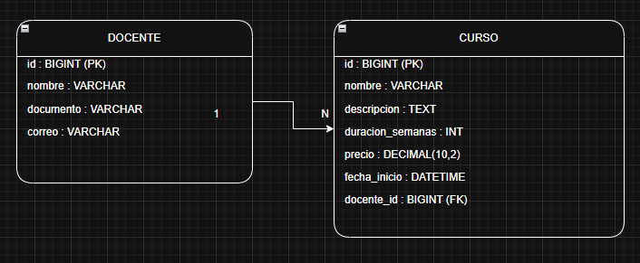

# API REST - Gestión de Cursos CESDE

Esta es una API REST desarrollada con **Spring Boot**, para gestionar cursos y docentes de CESDE.

## Funcionalidades

### Cursos
- Crear curso
- Listar cursos
- Actualizar curso
- Eliminar curso
- Filtros de búsqueda:
    - Por nombre
    - Por duración
    - Por precio máximo
    - Por docente

### Docentes
- Crear docente
- Listar docentes
- Actualizar docente
- Eliminar docente


### Diagrama entidad relación

---

## Tecnologías

- Java 17
- Spring Boot 3.2.5
- Spring Data JPA
- MySQL
- Spring Validation
- Swagger (OpenAPI)
- Lombok

---

## Requisitos

- Java 17 instalado
- MySQL instalado
- Maven instalado

---

## Configuración de la base de datos (MySQL)

Crea una base de datos:

```sql
       
-- Script MySQL para la base de datos de cursos CESDE

DROP DATABASE IF EXISTS cursos_db;
CREATE DATABASE cursos_db;
USE cursos_db;

-- Tabla Docente
CREATE TABLE docente (
                         id BIGINT AUTO_INCREMENT PRIMARY KEY,
                         nombre VARCHAR(255) NOT NULL,
                         documento VARCHAR(50) NOT NULL,
                         correo VARCHAR(255) NOT NULL
);

-- Tabla Curso
CREATE TABLE curso (
                       id BIGINT AUTO_INCREMENT PRIMARY KEY,
                       nombre VARCHAR(255) NOT NULL,
                       descripcion TEXT NOT NULL,
                       duracion_semanas INT NOT NULL,
                       precio DECIMAL(10,2) NOT NULL,
                       fecha_inicio DATETIME NOT NULL,
                       docente_id BIGINT NOT NULL,
                       CONSTRAINT fk_docente
                           FOREIGN KEY (docente_id)
                               REFERENCES docente(id)
                               ON DELETE RESTRICT
                               ON UPDATE CASCADE
);

-- Datos iniciales (opcional)
INSERT INTO docente (nombre, documento, correo)
VALUES
    ('Juan Pérez', '123456789', 'juan@cesde.edu.co'),
    ('Ana Gómez', '987654321', 'ana@cesde.edu.co');

INSERT INTO curso (nombre, descripcion, duracion_semanas, precio, fecha_inicio, docente_id)
VALUES
    ('Java Backend', 'Curso completo de Java backend', 8, 1500000.00, '2026-03-01 08:00:00', 1),
    ('Spring Boot', 'Curso de Spring Boot y REST', 6, 1200000.00, '2026-04-01 08:00:00', 2);
       
```

Archivo application.properties

Configura tu conexión a MySQL:
```properties
spring.datasource.url=jdbc:mysql://localhost:3306/cursos_db?useSSL=false&serverTimezone=UTC
spring.datasource.username=root
spring.datasource.password=tu_password

spring.jpa.hibernate.ddl-auto=update
spring.jpa.show-sql=true
```

Ejecutar el proyecto

Desde la terminal:
```bash
mvn clean install
mvn spring-boot:run
```

Documentación Swagger (OpenAPI)

Swagger UI está disponible en:
```bash
http://localhost:8080/swagger-ui/index.html
```


Para ejecutar el proyecto, asegúrate de tener MySQL en ejecución y la base de datos configurada correctamente. 
Luego, ejecuta los comandos Maven proporcionados para iniciar la aplicación Spring Boot.

```bach
mvn clean install
mvn spring-boot:run

http://localhost:8080/
```